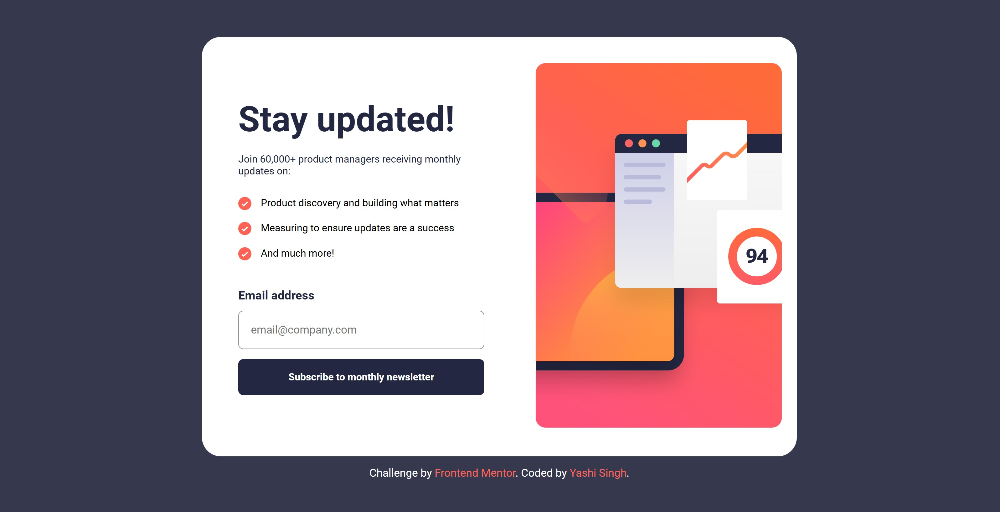

# Frontend Mentor - Newsletter Sign-Up Form With Success Message Solution

This is a solution to the [Newsletter sign-up form with success message challenge on Frontend Mentor](https://www.frontendmentor.io/challenges/newsletter-signup-form-with-success-message-3FC1AZbNrv). Frontend Mentor challenges help you improve your coding skills by building realistic projects.  

## Table of contents

- [Overview](#overview)
  - [The challenge](#the-challenge)
  - [Screenshot](#screenshot)
  - [Links](#links)
- [My process](#my-process)
  - [Built with](#built-with)
  - [What I learned](#what-i-learned)
  - [Continued development](#continued-development)
  - [Useful resources](#useful-resources)
- [Installation and Setup](#installation-and-setup)
- [Author](#author)

---

## Overview

### The challenge

Users should be able to:

- Add their email and submit the form
- See a success message with their email after successfully submitting the form
- See form validation messages if:
  - The field is left empty
  - The email address is not formatted correctly
- View the optimal layout for the interface depending on their device's screen size
- See hover and focus states for all interactive elements on the page

### Screenshot

**Desktop Design**



**Mobile View**


### Links

- **Solution URL**: [Solution Site](https://your-solution-url.com)
- **Live Site URL**: [Live Site](https://your-live-site-url.com)

---

## My process

### Built with

- Semantic HTML5 markup
- SASS (CSS Preprocessor)
- CSS Flexbox
- CSS Transitions and Animations
- Mobile-first workflow
- JavaScript for form validation and interactivity

---

### What I learned

In this challenge, I learned how to use **SASS** to structure my CSS more effectively and efficiently. The nested selectors made my styles more readable and maintainable. I also implemented smooth transitions for the button using SASS.

Example of button transition in SASS:

```sass
button
    padding: 1.2rem
    border-radius: 8px
    border: none
    cursor: pointer
    color: #fff
    background-color: $dark-slate-grey
    transition: background-color 0.3s ease, box-shadow 0.3s ease, transform 0.2s ease

    &:hover
        background: linear-gradient(to right, #FF527B, #FF6A3A)
        box-shadow: 0 16px 24px lighten(#FF6A3A, 10%)
        transform: translateY(-2px)
```

I also implemented form validation logic in JavaScript, dynamically changing the input border and error messages.

Example:

```javascript
if (!emailRegex.test(email.value)) {
  emailInput.classList.add('error-border');
  errorMessage.textContent = 'Please enter a valid email address';
}
```

---

### Continued development

In the future, I plan to focus on:

- Adding animations to success messages for smoother UX.
- Enhancing responsiveness for very small screen sizes.
- Using a CSS framework like **TailwindCSS** or **Bootstrap** to compare workflow speed with SASS.

---

### Useful resources

- [MDN Web Docs - Form Validation](https://developer.mozilla.org/en-US/docs/Learn/Forms/Form_validation) - This resource helped me understand how to validate forms in vanilla JavaScript.
- [SASS Documentation](https://sass-lang.com/documentation) - A fantastic guide for getting started with SASS and mastering its syntax.
- [CSS Tricks - Transitions](https://css-tricks.com/almanac/properties/t/transition/) - Helped me understand smooth transitions in CSS.

---

## Installation and Setup

To run this project locally, follow these steps:

### Prerequisites
Ensure you have the following installed:
- **Node.js** (v14+)
- **NPM** (comes with Node.js)

### 1. Clone the repository
```bash
git clone https://github.com/Yashi-Singh-9/Newsletter-Sign-Up-Form-With-Success-Message.git
cd Newsletter-Sign-Up-Form-With-Success-Message
```

### 2. Install SASS globally
If SASS is not installed yet, run:
```bash
npm install -g sass
```

### 3. Compile SASS to CSS
Run the following command in the project folder to compile your SASS file:

```bash
sass --watch style.sass style.css
```

This command watches your `style.sass` file and automatically compiles changes into `style.css`.

### 4. Open the project
Open the `index.html` file in your browser to view the project.

---

## Author

- LinkedIn - [Yashi Singh](https://www.linkedin.com/in/yashi-singh-b4143a246)
- Frontend Mentor - [Yashi-Singh-9](https://www.frontendmentor.io/profile/Yashi-Singh-9)

---

### Final Notes
This challenge helped me practice responsive design, JavaScript validation, and SASS preprocessing. It’s a great project for anyone looking to level up their front-end skills. 🎉